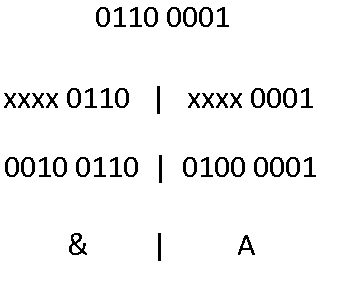

**Youtube:** https://www.youtube.com/watch?v=mblap1OHtRg

# About
Nesse repositório tem dois projetos **write** e **read**.  

**write** tem como idéia receber uma mensagem e criptografar ela para ninguém descobrir a mensagem que tinha nela.  
Para usar basicamente abra o *write.exe*, escreva a mensagem e aparte enter, a mensagem criptografada vai estar no arquivo *write.txt*.  

**read** tem como idéia ler a mensagem criptografada no arquivo *write.txt*.  
Para usar ele bote o arquivo *write.txt* na pasta do *read.exe* e depois execute o *read.exe*.  

**Código do write**: https://github.com/thiagola92/Simples-Criptografia/blob/master/write/write/main.cpp  
**Código do read**: https://github.com/thiagola92/Simples-Criptografia/blob/master/read/read/main.cpp  
Qualquer outro arquivo dentro das pastas read/write foram criadas pelo próprio Visual Studio.  

# How it works
Vamos supor que o texto que você quer criptografar seja apenas a letra a, em binário é 0110 0001.  
O que eu fiz foi dividir o byte da letra a em dois, **0110** e **0001**.  
Usarei cada uma dessas partes para criar letras novas, **xxxx 0110** e **xxxx 0001**, sendo que **xxxx** é uma sequência de 1 e 0 aleatória.  

  

Logo o programa teria criptografado, a mensagem "a" para "&A".  
